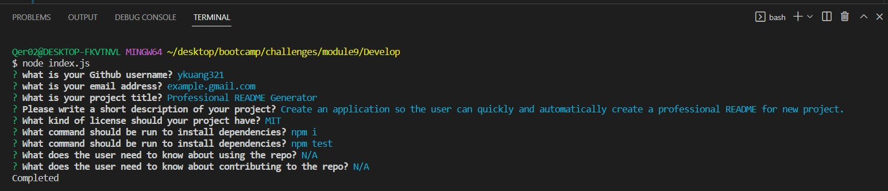

# Professional README Generator 

## Project Task
Create a command-line application so the user can quickly and automatically create a professional README for new project.


## How does this application work?
When the user open the integrated terminal and type in command "node index.js", he/she will be promoted 
to a series of questions regarding the new project. After the user answers all the questions, the README file 
will be generated automatically.


## User Story

```
A software developer wants to create a professional README for a new project quickly and automatically.
```


## Acceptance Criteria

```
This application should include:
1. When the user enters the project title, it will be displayed as the title of the README.
2. When the user enters the a description, installation instructions, usage information, 
   contribution guidelines, and test instructions, the information is added to the sections
   of the README entitled Description, Installation, Usage, Contributing, and Tests.
3. When the user choose a license for the application from a list of options, a badge for 
   that license is added near the top of the README and a notice is added to the section of
   the README entitled License that explains which license the application is covered under.
4. When the user enters the GitHub username, it will be added to the section of the README 
   entitled Questions, with a link to the user's GitHub profile.
5. When the user enters the email address, it will be added to the section of the README 
   entitled Questions, with instructions on how to reach me with additional questions.
6. When the user click on the links in the Table of Contents, the user will be taken to the 
   corresponding section of the README
```


## Moke Up

The following image shows the application's appearance:

*Terminal with node command to start the application:*


*Series of questions:*


*Professional README:*


## Video Demo
[Professional README Generator Video Demo](https://app.castify.com/view/ada9deec-8971-4129-8932-84aebf992c4b)

## Reference
[How to create a Professional README](https://coding-boot-camp.github.io/full-stack/github/professional-readme-guide)
